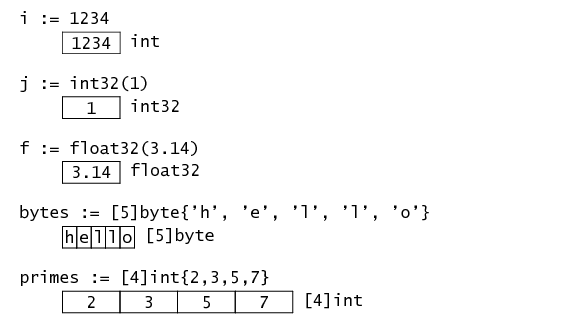

# Data Types

The following are the basic data types available in Go

- bool
- Numeric Types
  - int8, int16, int32, int64, int
  - uint8, uint16, uint32, uint64, uint
  - float32, float64
  - complex64, complex128
  - byte
  - rune
- string

**There are also `byte` and `rune`. They are equivalent to `uint8` and `int32`, respectively.**

Note: In computer programming, `monkey patching` is a technique used to dynamically update the behavior of a piece of code at run-time. `It is used to extend or modify the runtime code of dynamic languages` such as `Smalltalk`, JavaScript, `Objective-C`, `Ruby`, `Perl`, `Python`, `Groovy`, and `Lisp` without altering the original source code.

### Basic types

- The variable i has type int, represented in memory as a single 32-bit word. (All these pictures show a 32-bit memory layout; in the current implementations, only the pointer gets bigger on a 64-bit machine—int is still 32 bits—though an implementation could choose to use 64 bits instead.)

- The variable j has type int32, because of the explicit conversion. Even though i and j have the same memory layout, they have different types: the assignment i = j is a type error and must be written with an explicit conversion: i = int(j).

- The variable f has type float, which the current implementations represent as a 32-bit floating-point value. It has the same memory footprint as the int32 but a different internal layout.

#### If you need to compare types you defined, you shouldn't use `reflect.TypeOf(xxx)`. Instead, use `reflect.TypeOf(xxx).Kind()`.

**There are two categories of types:**

- direct types (the types you defined directly)
- basic types (`int`, `float64`, `struct`, ...)

> Here's the conclusion. 

If you need to compare with basic types, use `reflect.TypeOf(xxx)`.Kind(); and if you need to compare with self-defined types, use `reflect.TypeOf(xxx)`.